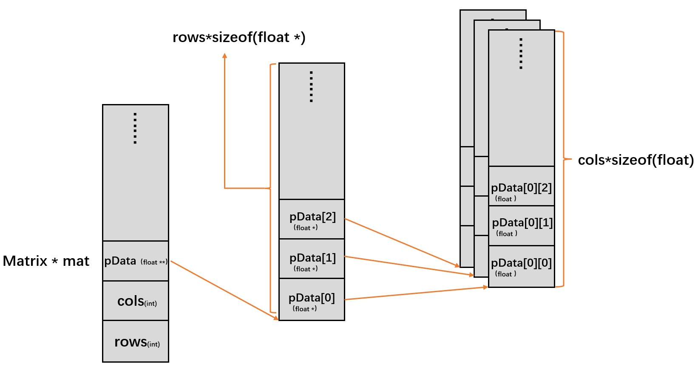
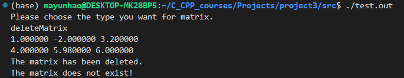
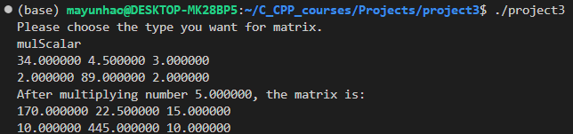
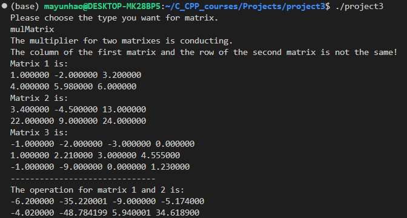
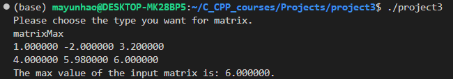
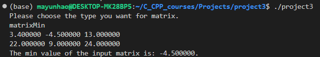

# **CS205 C/ C++ Program Design - Project 3**

**Name: Yunhao Ma**

**SID: 11911523**

# **Part 1 - Analysis** and Key Code

In this project, the data type `struct` must be built to make a structure of properties in each matrix, including rows, columns and data. Besides, several matrix operations are implemented in C as methods to make a clear and useful library for users to use. In all method, `const` is used for read-only process. Besides, in this project, I also use **Cmake**  to manage my files, which is quite convenient.

**1. Structure**

In this project,  `struct` is used to store different types of data of each matrix, there the properties are size of rows, size of columns, a float pointer to data. The structure matrix can be declared like this:

```c
typedef struct Matrix
{   int rows;
    int cols;
    float ** pData;
}Matrix;
```

The principle of this idea can be shown as the following figure. The `* *` in C means the address of address; in the other word, it is more like a two dimensional array, matching the basic property of the matrix. 



**2. Create a matrix**

In this case, `malloc()`is used to allocate some memory for a matrix. Besides, if the matrix has initialized values, the user should offer not only rows and columns of this matrix, but also a path ended with `.txt` which contains the value of input matrix for using this method. In the input file is `NULL`, the matrix is initialized as zero in every coordinate. The code is displayed as the following. Firstly, the method will check the rows and columns inputs. Second, `malloc()` is used for space in PC. In the end, the function will return a structure pointer `*Matrix` .

```c
Matrix * creatMatrix(const int row, const int col, const char * filename){
    if (row<=0||col<=0)
    {
        printf("The parameters should be positive integer!\n");
        return NULL;
    }
    Matrix *mat = (Matrix *)malloc(sizeof(Matrix));
    mat->rows = row;
    mat->cols = col;
    mat->pData =  (float **)malloc(row*sizeof(float*));
    //allocate memory for rows in **
    for (int i = 0; i < row; i++)
    {
        mat->pData[i] = (float *)malloc(col*sizeof(float));
        //allocate memory for cols in *
    }
    if (filename!=NULL)
    {
        FILE *file = fopen(filename,"r");
    if (file==NULL)
        {
            printf("Input file does not exist.\n");
            return NULL;
        }
    else
        {
            float temp;
            for (int i = 0; i < row; i++)
            {
                for (int j = 0; j < col; j++)
                {
                    fscanf(file, "%f", &temp);
                    mat->pData[i][j] = temp;
                }
            }
        }
    }
    return mat;
}
```

**3. Delete a matrix**

In this case, every initialization of `malloc()` should have its corresponding `free()` to release memory. In the previous method, three different memory space are allocated; thus, there needs free for all of them. What should be noticed is that after conducting `free()`, I should set the value in memory of mat to be 0, and make the pointer `NULL` again, to ensure the system privacy and avoid wild pointers.

```c
void deleteMatrix(Matrix ** p_mat){
    Matrix * mat = *p_mat;
    if (mat==NULL)
    {
        printf("The aimed matrix does not exist!\n");
        return;
    }
    else
    {
        for (int i = 0; i < mat->rows; i++)
        {
            free(mat->pData[i]);//free the cols for mat
        }
        free(mat->pData);//free the rows for mat
        free(mat);//free the created structure 
        printf("The matrix has been deleted.\n");
        memset(mat, 0, sizeof(Matrix)); //this step is not needed, but to ensure privacy
        *p_mat = NULL;
        return;
    }
}
```

**4. Copy a matrix**

To copy a matrix, it doesn't mean `matrix m2 = matrix m1` .A new matrix should be constructed, and copy the old values to it, not by address. Otherwise if one of them are changed, the other will change as well.

```c
Matrix * copyMatrix(const Matrix * mat){
    Matrix * mat_copy = creatMatrix(mat->rows,mat->cols,NULL);
    if (mat==NULL)
    {
        printf("The aimed matrix does not exist!\n");
        return NULL;
    }
    for (int i = 0; i < mat->rows; i++)
    {
        for (int j = 0; j < mat->cols; j++)
        {
            mat_copy->pData[i][j] = mat->pData[i][j];
        }
    }
    return mat_copy;
}
```

**5. Conduct addition in matrices**

To add two matrices, firstly, if the pointer of the input matrices are NULL or the sizes of them are not the same, return directly. Else, do the corresponding addition coordinate by coordinate. The returned value is the pointer as well. 

```c
Matrix * addMatrix( const Matrix *mat1, const  Matrix *mat2){
    Matrix * mat_add = creatMatrix(mat1->rows,mat1->cols,NULL);
    if (mat1==NULL||mat2==NULL)
    {
        printf("The input matrixes do not exist!\n");
        return NULL;
    }
    else if (mat1->cols!=mat2->cols||mat1->rows!=mat2->rows)
    {
        printf("The size of input matrixes is not the same!\n");
        return NULL;
    }
    else 
    for (int i = 0; i < mat1->rows; i++)
    {
        for (int j = 0; j < mat1->cols; j++)
        {
            mat_add->pData[i][j] = mat1->pData[i][j]+mat2->pData[i][j];
        }
    }
    return mat_add;
}
```

**6. Conduct subtraction in matrices**

To subtract a matrix from another, firstly, if the pointer of the input matrices are NULL or the sizes of them are not the same, return directly. Else, do the corresponding subtraction coordinate by coordinate. The returned value is the pointer as well. 

```c
Matrix * subtractMatrix(const  Matrix *mat1, const  Matrix *mat2){
    Matrix * mat_sub = creatMatrix(mat1->rows,mat1->cols,NULL);
    if (mat1==NULL||mat2==NULL)
    {
        printf("The input matrixes do not exist!\n");
        return NULL;
    }
    else if (mat1->cols!=mat2->cols||mat1->rows!=mat2->rows)
    {
        printf("The size of input matrixes is not the same!\n");
        return NULL;
    }
    else 
    for (int i = 0; i < mat1->rows; i++)
    {
        for (int j = 0; j < mat1->cols; j++)
        {
            mat_sub->pData[i][j] = mat1->pData[i][j]-mat2->pData[i][j];
        }
    }
    return mat_sub;
}
```

**7. Add scalar, Subtract scalar and Multiply scalar to one matrix**

In these two cases, certain scalar is conducted. Very easy algorithm is proposed.

Code for addition:

```c
Matrix * addScalar(const  Matrix * mat1, float num){
    Matrix * mat_add_sca = creatMatrix(mat1->rows,mat1->cols,NULL);
    if (mat1==NULL)
    {
        printf("The input matrix does not exist!\n");
        return NULL;
    }
    for (int i = 0; i < mat1->rows; i++)
    {
        for (int j = 0; j < mat1->cols; j++)
        {
            mat_add_sca->pData[i][j] = mat1->pData[i][j]+num;
        }
    }
    return mat_add_sca;
}

```

Code for subtraction:

```c
Matrix * subtractScalar( const  Matrix * mat1, float num){
    Matrix * mat_sub_sca = creatMatrix(mat1->rows,mat1->cols,NULL);
    if (mat1==NULL)
    {
        printf("The input matrix does not exist!\n");
        return NULL;
    }
    for (int i = 0; i < mat1->rows; i++)
    {
        for (int j = 0; j < mat1->cols; j++)
        {
            mat_sub_sca->pData[i][j] = mat1->pData[i][j]-num;
        }
    }
    return mat_sub_sca;
}
```

Code for multiply:

```c
Matrix * mulScalar(const  Matrix * mat1, float num){
    Matrix * mat_mul_sca = creatMatrix(mat1->rows,mat1->cols,NULL);
    if (mat1==NULL)
    {
        printf("The input matrix does not exist!\n");
        return NULL;
    }
    for (int i = 0; i < mat1->rows; i++)
    {
        for (int j = 0; j < mat1->cols; j++)
        {
            mat_mul_sca->pData[i][j] = mat1->pData[i][j]*num;
        }
    }
    return mat_mul_sca;
}
```

**8. Multiply for two matrices**

In this case, the system must ensure that the size of columns of input matrix one is the same as the size of rows of input matrix two. Otherwise, the system will print error information and return NULL pointer. If every thing goes right, three `for` loop is implemented to calculate values number by number. The code is shown as the following.

```c
Matrix * mulMatrix(const  Matrix * mat1,const  Matrix * mat2){
    if (mat1->cols!=mat2->rows)
    {
        printf("The column of the first matrix and the row of the second matrix is not the same!\n");
        return NULL;
    }
    Matrix * mat_mul = creatMatrix(mat1->rows,mat2->cols,NULL);
    for (int i = 0; i < mat1->rows; i++)
    {
        for (int j = 0; j < mat2->cols; j++)
        {
            float sum = 0;
            for (int x = 0; x < mat1->cols; x++)
            {
                sum += mat1->pData[i][x]*mat2->pData[x][j];
            }
            mat_mul->pData[i][j] = sum;
        }
    }
    return mat_mul;
}
```

 **9. Find the extreme value in a matrix**

In these two methods, the maximum and the minimum of certain matrix is found.

```c
float matrixMax(const  Matrix * mat){
    float max = 0;
    for (int i = 0; i < mat->rows; i++)
    {
        for (int j = 0; j < mat->cols; j++)
        {
            max = (max < mat->pData[i][j])?mat->pData[i][j] : max;
        }
    }
    return max;
}

float matrixMin(const  Matrix * mat){
    float min = 0;
    for (int i = 0; i < mat->rows; i++)
    {
        for (int j = 0; j < mat->cols; j++)
        {
            min = (min < mat->pData[i][j])?min : mat->pData[i][j];
        }
    }
    return min;
}
```

 **10. Print a matrix**

Firstly the system will check the validity of `mat`, return directly if the pointer is NULL. Otherwise, print the matrix.

```c
void printMatrix(const Matrix * mat){
    if (mat==NULL)
    {
        printf("The matrix does not exist!\n");
        return;
    }
    else{
        for (int i = 0; i < mat->rows; i++)
        {
            for (int j = 0; j < mat->cols; j++)
            {
                printf("%f ",mat->pData[i][j]);
            }
            printf("\n");
        }
        return;
    }
}
```

# **Part 2 - Verifications and Results**

Test case 1: **Create Matrix**<br>
<br>Test case 2: **Delete Matrix**<br>
<br>Test case 3: **Copy Matrix**<br>
<br>Test case 4: **Add Matrix**<br>
<br>
Test case 5: **Subtract Matrix**<br><br>Test case 6: **Add Scalar**<br> <br>
Test case 7: **Subtract Scalar **<br>
<br>
Test case 8: **Multiply Scalar**<br>
<br>Test case 9: **Multiply Matrix**<br>

Test case 10: **Find Matrix Maximum**<br>
<br>

Test case 11: **Find Matrix Minimum**<br>
<br>

# **Part 3 - Challenges and Solutions**

1. During this project, I encounter lots of difficulties, but gain lots of experience. First of all, since the constrain of language C is highly required in this project, there are some differences should be noticed. In C++, the initialization of a memory can use `new` to declare a new space for memory use. However, in C, in I have to spend some time learning the difference characteristics of C and C++, where `malloc()` is used to allocate the memory. After using that, `free()` are needed to release memory space, which is very important. Generally, It is very important to notice how the memory are used in C and C++.

1. Secondly, the use of pointer is quite essential in coding. In this project, I use pointer as the address of another address of the specific values. The double projection matches the property of matrices, in other words, two-dimensional array. The pointer points a special address of each data type, making it possible to store data in very large amount. However, in `deleteMatrix` I find it very difficult. In the end, I make the argument to be reference to clear the memory by correct address. In a word, the pointer is very useful and charming. I should learn how to use it better in the future.

1. I have met segmentation fault many times. When I firstly created a matrix, I didn't allocate memory for the float `** matrix.` Besides, the initialization of structure can not be initialized as  `NULL` , which is very detailed to avoid such problems. Many small bugs will lead to segmentation faults; thus, I should take care of using methods and paying attention to my further work.

1. Last, the use of Cmake is quite good. In the terminal, I just use `make` to compile to the final output. I can then directly use that!

1. Thank you sincerely for reading my report. I am looking forward to the next project.
